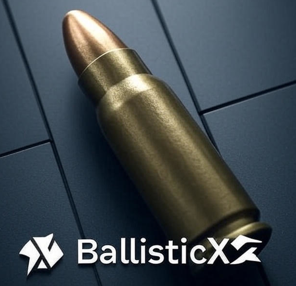

<!-- Improved compatibility of back to top link: See: https://github.com/ksmeltzer/ballisticx/pull/73 -->
<a id="readme-top"></a>
<!--
*** Thanks for checking out the ballisticx. If you have a suggestion
*** that would make this better, please fork the repo and create a pull request
*** or simply open an issue with the tag "enhancement".
*** Don't forget to give the project a star!
*** Thanks again! Now go create something AMAZING! :D
-->


<!-- PROJECT SHIELDS -->
<!--
*** I'm using markdown "reference style" links for readability.
*** Reference links are enclosed in brackets [ ] instead of parentheses ( ).
*** See the bottom of this document for the declaration of the reference variables
*** for contributors-url, forks-url, etc. This is an optional, concise syntax you may use.
*** https://www.markdownguide.org/basic-syntax/#reference-style-links
-->
[![Contributors][contributors-shield]][contributors-url]
[![Forks][forks-shield]][forks-url]
[![Stargazers][stars-shield]][stars-url]
[![Issues][issues-shield]][issues-url]
[![Unlicense License][license-shield]][license-url]
[![LinkedIn][linkedin-shield]][linkedin-url]


<!-- PROJECT LOGO -->
<br />
<div align="center">
  <a href="https://github.com/ksmeltzer/BallisticX">
    
  </a>

  <h3 align="center">BallisticX</h3>

  <p align="center">
    A comprehensive Typescript library that provides common, internal, external and terminal ballistics calculations and functionality!
    <br />
    <a href=""><strong>Explore the docs »</strong></a>
    <br />
    <br />
    <a href="">View Demo</a>
    &middot;
    <a href="https://github.com/ksmeltzer/BallisticX/issues">Report Bug</a>
    &middot;
    <a href="https://github.com/ksmeltzer/BallisticX/issues">Request Feature</a>
  </p>
</div>


<!-- TABLE OF CONTENTS -->
<details>
  <summary>Table of Contents</summary>
  <ol>
    <li>
      <a href="#about-the-project">About The Project</a>
      <ul>
        <li><a href="#built-with">Built With</a></li>
      </ul>
    </li>
    <li>
      <a href="#getting-started">Getting Started</a>
      <ul>
        <li><a href="#prerequisites">Prerequisites</a></li>
        <li><a href="#installation">Installation</a></li>
      </ul>
    </li>
    <li><a href="#usage">Usage</a></li>
    <li><a href="#roadmap">Roadmap</a></li>
    <li><a href="#contributing">Contributing</a></li>
    <li><a href="#license">License</a></li>
    <li><a href="#contact">Contact</a></li>
    <li><a href="#acknowledgments">Acknowledgments</a></li>
  </ol>
</details>


<!-- ABOUT THE PROJECT -->
## About The Project

BallisticX is a base Typescript library for ballistic calculation, it draws some inspiration from the GNU Ballistic computer but was initiated as a way for the author to learn the deeper nuances of small arms ballistics. The library provides calculation functions for the following sub-disciplines of ballistics:

* Internal
* External
* Terminal


While there are tests within the project to execute the functionality, this project in and of itself is not meant to be a end user product rather it is the basic library for ballistics modeling and calculations. I have plans for further visualization projects that will build on-top of this library to provide things like ballistic computer, LIDAR, tracking, pressure testing, trajectory modeling etc.


<p align="right">(<a href="#readme-top">back to top</a>)</p>


### Built With


* [![Node][Node-badge]][Node-url]
* [![TypeScript][Typescript-badge]][Typescript-url]
* [![Vitest][Vitest-badge]][Vitest-url]

<p align="right">(<a href="#readme-top">back to top</a>)</p>


<!-- GETTING STARTED -->
## Getting Started

If you are just looking to utilize the library in your own project you only need to install the npm:

** npm
  ```sh
  npm install ballisticx@latest -g
  ```


### Prerequisites

If you would like to contribute to or just run the project you will need to prerequisits:

https://github.com/nvm-sh/nvm

* nvm
  ```sh
  nvm install stable
  nvm use stable
  ```

### Installation


1. Clone the repo
   ```sh
   git clone https://github.com/ksmeltzer/BallisticX
   ```
3. Install NPM packages
   ```sh
   npm install
   ```
3. Run the build
   ```sh
   npm run build
   ```
5. Run the tests
   ```sh
   npm run test
   ```

<p align="right">(<a href="#readme-top">back to top</a>)</p>


See the [open issues](https://github.com/ksmeltzer/ballisticx/issues) for a full list of proposed features (and known issues).

<p align="right">(<a href="#readme-top">back to top</a>)</p>


<!-- CONTRIBUTING -->
## Contributing

Contributions are what make the open source community such an amazing place to learn, inspire, and create. Any contributions you make are **greatly appreciated**.

If you have a suggestion that would make this better, please fork the repo and create a pull request. You can also simply open an issue with the tag "enhancement".
Don't forget to give the project a star! Thanks again!

1. Fork the Project
2. Create your Feature Branch (`git checkout -b feature/AmazingFeature`)
3. Commit your Changes (`git commit -m 'Add some AmazingFeature'`)
4. Push to the Branch (`git push origin feature/AmazingFeature`)
5. Open a Pull Request

### Top contributors:

<a href="https://github.com/ksmeltzer/ballisticx/graphs/contributors">
  
</a>

<p align="right">(<a href="#readme-top">back to top</a>)</p>


<!-- LICENSE -->
## License

Distributed under the Apache 2.0 License. See `LICENSE.txt` for more information.

<p align="right">(<a href="#readme-top">back to top</a>)</p>


<!-- CONTACT -->
## Contact

Your Name - [@your_twitter](https://x.com/klsmeltzer) - ksmeltzer@gmail.com

Project Link: [https://github.com/ksmeltzer/BallisticX](https://github.com/ksmeltzer/BallisticX)

<p align="right">(<a href="#readme-top">back to top</a>)</p>


<!-- ACKNOWLEDGMENTS -->
## Acknowledgments

Use this space to list resources you find helpful and would like to give credit to. I've included a few of my favorites to kick things off!

* [Choose an Open Source License](https://choosealicense.com)
* [GitHub Emoji Cheat Sheet](https://www.webpagefx.com/tools/emoji-cheat-sheet)
* [Malven's Flexbox Cheatsheet](https://flexbox.malven.co/)
* [Malven's Grid Cheatsheet](https://grid.malven.co/)
* [Img Shields](https://shields.io)
* [GitHub Pages](https://pages.github.com)
* [Font Awesome](https://fontawesome.com)
* [React Icons](https://react-icons.github.io/react-icons/search)

<p align="right">(<a href="#readme-top">back to top</a>)</p>


<!-- MARKDOWN LINKS & IMAGES -->
<!-- https://www.markdownguide.org/basic-syntax/#reference-style-links -->
[contributors-shield]: https://img.shields.io/github/contributors/ksmeltzer/ballisticx.svg?style=for-the-badge
[contributors-url]: https://github.com/ksmeltzer/ballisticx/graphs/contributors
[forks-shield]: https://img.shields.io/github/forks/ksmeltzer/ballisticx.svg?style=for-the-badge
[forks-url]: https://github.com/ksmeltzer/ballisticx/network/members
[stars-shield]: https://img.shields.io/github/stars/ksmeltzer/ballisticx.svg?style=for-the-badge
[stars-url]: https://github.com/ksmeltzer/ballisticx/stargazers
[issues-shield]: https://img.shields.io/github/issues/ksmeltzer/ballisticx.svg?style=for-the-badge
[issues-url]: https://github.com/ksmeltzer/BallisticX/blob/main/LICENSE
[license-shield]: https://img.shields.io/github/license/ksmeltzer/ballisticx.svg?style=for-the-badge
[license-url]: https://github.com/ksmeltzer/ballisticx/blob/master/LICENSE.txt
[linkedin-shield]: https://img.shields.io/badge/-LinkedIn-black.svg?style=for-the-badge&logo=linkedin&colorB=555
[linkedin-url]: https://www.linkedin.com/in/kentonsmeltzer/
[Node-badge]: https://img.shields.io/badge/node.js-000000?style=for-the-badge&logo=nodedotjs&logoColor=white
[Node-url]: https://nodejs.org/
[Vitest-badge]: https://img.shields.io/badge/Vitest-35495E?style=for-the-badge&logo=vitest&logoColor=4FC08D
[Vitest-url]: https://vitest.dev/
[Typescript-badge]: https://img.shields.io/badge/Typescript-563D7C?style=for-the-badge&logo=typescript&logoColor=white
[Typescript-url]: https://www.typescriptlang.org/
